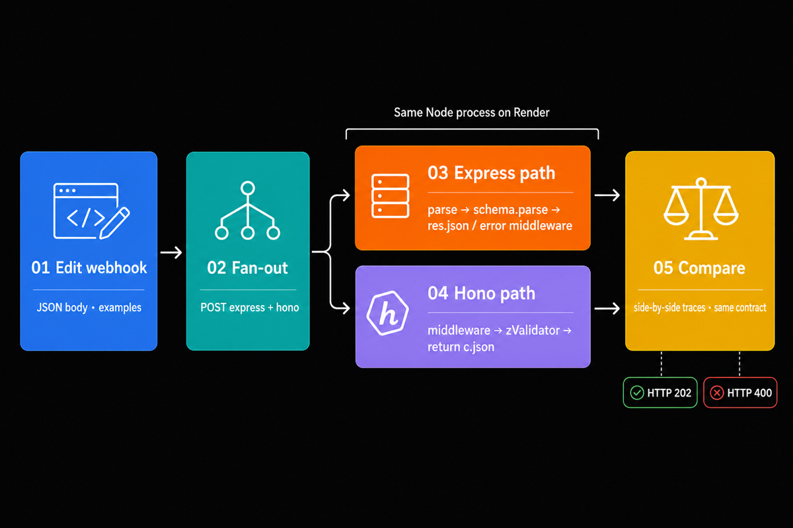

# TwinRoute

One webhook request, two framework boundaries: Express and Hono on the same Render web service.

[](https://dashboard.render.com/blueprint/new?repo=https://github.com/ojusave/twinroute)

## Highlights

- **Side-by-side request lab**: edit one JSON webhook, run it through Express and Hono, and inspect both traces and response bodies.
- **Shared contract**: both routes use the same Zod schema and the same success/failure JSON shape from `@inspector/contract`.
- **Separate framework mounts**: a native Node `http` server sends `/api/express/*` to Express and `/api/hono/*` to Hono, so neither framework wraps the other's API route.
- **One Render service**: free Node web service with a Blueprint deploy, health check at `/health`, and TypeScript build in CI/deploy.

## Overview

TwinRoute is a small comparison app for people deciding how an HTTP boundary should feel in TypeScript. The successful request is intentionally boring: accept an `invoice.paid` webhook and return HTTP 202. What changes is how each framework parses JSON, validates input, runs middleware, and produces errors.

Express uses `req`, `res`, `next`, explicit `schema.parse`, and error middleware. Hono uses a typed `Context`, `zValidator`-inferred input, composed middleware, and a returned `Response`. The business result can match; the control flow does not have to.




## Usage

1. Open the deployed app (or `http://localhost:3000` after a local start).
2. Pick an example: Valid, Missing field, or Wrong type.
3. Click **Run through both**.
4. Compare the Express and Hono panels: request path, response body, and the route-shaped code snippet under each column.

Valid body:

```json
{
  "event": "invoice.paid",
  "payload": {
    "id": "in_2048",
    "amount": 4900,
    "currency": "USD"
  }
}
```

Both frameworks return HTTP 202 with the same accepted payload. Remove `payload.id` and both return HTTP 400: Express through error middleware, Hono through the validator hook.

### API

| Method | Path | Purpose |
| --- | --- | --- |
| `POST` | `/api/express/run` | Run the webhook through Express |
| `POST` | `/api/hono/run` | Run the webhook through Hono |
| `GET` | `/api/examples` | Example JSON bodies for the UI |
| `GET` | `/api/config` | Service name, region, deploy, and repo URLs |
| `GET` | `/health` | Health check |

## Deploy on Render

Prerequisites: a [Render account](https://dashboard.render.com/register?utm_source=github&utm_medium=referral&utm_campaign=ojus_demos&utm_content=readme_link) and Node is handled by the Blueprint.

1. Click **Deploy to Render** above (or open the [Blueprint deploy link](https://dashboard.render.com/blueprint/new?repo=https://github.com/ojusave/twinroute)).
2. Confirm the Blueprint creates the `twinroute` web service from [`render.yaml`](./render.yaml).
3. Wait until the service is live, then open the service URL.
4. Confirm `GET /health` returns `{"ok":true,"app":"twinroute"}`.

| Resource | Type | Plan | Notes |
| --- | --- | --- | --- |
| `twinroute` | Web (`runtime: node`) | free | Region `oregon`; health check `/health`; build compiles TypeScript |

The Render build runs `npm ci --include=dev && npm run build` so TypeScript is available at build time before `npm start`.

## Configuration

| Variable | Required | Default / source | Purpose |
| --- | --- | --- | --- |
| `PORT` | No | `3000` locally; injected by Render | HTTP listen port; bind is `0.0.0.0` |
| `NODE_ENV` | No | `production` in Blueprint | Affects static-asset cache headers |
| `APP_REGION` | No | `oregon` in Blueprint; falls back to `Render` / `local` | Shown in service config metadata |
| `RENDER_SERVICE_NAME` | Auto on Render | `twinroute` fallback | Service label for the UI |
| `RENDER_GIT_REPO_SLUG` | Auto on Render | none | Builds the GitHub and Deploy button URLs when unset elsewhere |
| `REPOSITORY_URL` | No | derived from `RENDER_GIT_REPO_SLUG` | Override the repo URL used by `/api/config` |

No database, Redis, or third-party API keys are required.

## Project structure

```text
apps/twinroute/          Native Node server mounting Express + Hono
packages/contract/       Shared Zod schema, examples, and run result types
packages/ui/             Static Request Lab UI
tests/                   Integration tests against both /run endpoints
render.yaml              Render Blueprint
```

## Local development

Requires Node.js 24.

```bash
npm install
npm run build
npm start
```

Optional checks:

```bash
npm test
npm run typecheck
render blueprints validate
```

## License

MIT
