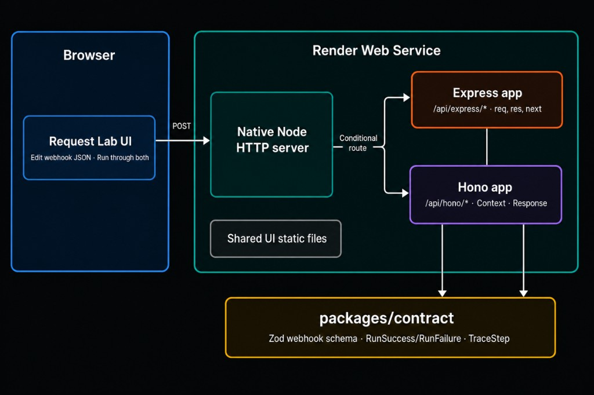
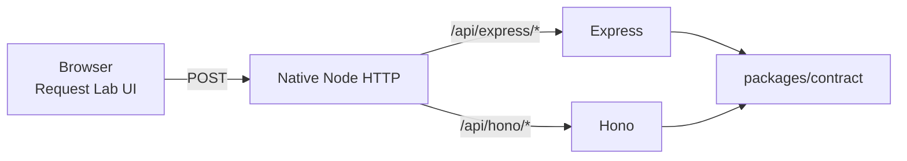

<div align="center">

# TwinRoute on Render

Deploy **TwinRoute**, a side-by-side Express vs Hono webhook request lab, on one Node web service: shared Zod contract, separate framework mounts, Request Lab UI.

<p>
  <a href="https://dashboard.render.com/blueprint/new?repo=https://github.com/ojusave/twinroute">
    
  </a>
</p>

<p>
  <a href="https://render.com">
    
  </a>
  <a href="https://expressjs.com/">
    
  </a>
  <a href="https://hono.dev/">
    
  </a>
  <a href="https://nodejs.org/">
    
  </a>
</p>

</div>



## What This Template Shows

This repo is a one-click Render Blueprint for comparing HTTP boundaries in TypeScript. One webhook body runs through Express and Hono in the same Node process; the UI shows both traces and response bodies.

| Piece | Role |
| --- | --- |
| **[TwinRoute](https://github.com/ojusave/twinroute)** | Request Lab UI plus dual `/run` API routes |
| **[Render Web Service](https://render.com/docs/web-services)** | Native Node 24 service: build TypeScript, serve UI and APIs |
| **[Express 5](https://expressjs.com/)** | `/api/express/*`: `req`, `res`, `next`, error middleware |
| **[Hono](https://hono.dev/)** | `/api/hono/*`: typed `Context`, `zValidator`, returned `Response` |
| **`@inspector/contract`** | Shared Zod schema, examples, and success/failure types |

No database, disk, or third-party API keys. The successful path accepts an `invoice.paid` webhook and returns HTTP 202; invalid bodies return HTTP 400 on both sides with different framework error paths.

## Architecture



### How It Works

1. Click **Deploy to Render**. Render applies [`render.yaml`](./render.yaml) from this repo.
2. Render runs `npm ci --include=dev && npm run build`, then `npm start` on the `twinroute` web service.
3. Open the public URL. Edit the webhook JSON (or pick Valid / Missing field / Wrong type) and click **Run through both**.
4. Compare the Express and Hono panels: request path, response body, and the route-shaped snippet under each column.

| Resource | Type | Plan | Notes |
| --- | --- | --- | --- |
| `twinroute` | Web (`runtime: node`) | **free** | Health check `/health`; TypeScript compiles at build time |

Default region: **oregon**. No database or disk: request/response traces are computed per request and returned to the browser.

A native Node `http` server sends `/api/hono/*` to Hono and everything else to Express, so neither framework wraps the other's API route.

## Quick Start

### Prerequisites

- A [Render account](https://dashboard.render.com/register?utm_source=github&utm_medium=referral&utm_campaign=ojus_demos&utm_content=readme_link)

### Deploy

1. Click **Deploy to Render** above.
2. On Apply, confirm the `twinroute` web service. No secrets are required.
3. Wait until the service is **Live** (~2–5 minutes).
4. Open the public URL and run the Valid example, then Missing field.

Health check:

```bash
curl -sS https://<your-service>.onrender.com/health
```

Expected: `{"ok":true,"app":"twinroute"}`.

Valid webhook body both routes accept:

```json
{
  "event": "invoice.paid",
  "payload": {
    "id": "in_2048",
    "amount": 4900,
    "currency": "USD"
  }
}
```

| Method | Path | Purpose |
| --- | --- | --- |
| `POST` | `/api/express/run` | Run through Express |
| `POST` | `/api/hono/run` | Run through Hono |
| `GET` | `/api/examples` | Example JSON for the UI |
| `GET` | `/api/config` | Region, service name, deploy/repo URLs |
| `GET` | `/health` | Health check |

## Features

| Feature | Description |
| --- | --- |
| **Side-by-side lab** | One JSON body, two framework traces and responses |
| **Shared contract** | Same Zod schema and RunSuccess / RunFailure shape |
| **Separate mounts** | Native Node dispatch; Express and Hono stay on their own prefixes |
| **One Blueprint service** | Free Node web service, health check, TS build in deploy |
| **Zero secrets** | No DB, Redis, or third-party keys to configure |

## Configuration

| Variable | Source | Description |
| --- | --- | --- |
| `PORT` | Wired | Injected by Render; local default `3000`; bind `0.0.0.0` |
| `NODE_ENV` | Wired | `production` in the Blueprint (static cache headers) |
| `APP_REGION` | Wired | `oregon` in the Blueprint; shown via `/api/config` |
| `RENDER_SERVICE_NAME` | Auto on Render | Service label in the UI (`twinroute` fallback) |
| `RENDER_GIT_REPO_SLUG` | Auto on Render | Builds GitHub / Deploy URLs when set |
| `REPOSITORY_URL` | Optional | Override repo URL used by `/api/config` |

## Cost

| Resource | Approx. monthly |
| --- | ---: |
| Web service (Free) | $0 |
| **Total** | **$0** |

Free web services spin down after inactivity. Expect a cold start on the first request after idle time. Upgrade the plan in the Dashboard if you want the lab always warm.

## Troubleshooting

| Problem | Solution |
| --- | --- |
| Health check fails / deploy stuck building | Confirm `buildCommand` includes `--include=dev` so TypeScript is installed before `npm run build`. |
| Cold start / slow first load | Free plan spin-down. Retry after wake, or move `twinroute` to Starter. |
| Both panels show validation errors | The body failed the shared Zod schema. Use the Valid example, or restore `payload.id`. |
| Only one framework responds | Check the path: Express is `/api/express/run`, Hono is `/api/hono/run`. |
| Deploy button opens wrong repo | Blueprint URL must use `repo=https://github.com/ojusave/twinroute`. |

## Project Structure

```
render.yaml              Render Blueprint (Node web service)
README.md                This file
LICENSE                  MIT
assets/                  README hero diagram
apps/twinroute/          Native Node server mounting Express + Hono
packages/contract/       Shared Zod schema, examples, run types
packages/ui/             Static Request Lab UI
tests/                   Integration tests against both /run endpoints
```

## Learn More

**Render:**
- [Web Services](https://render.com/docs/web-services)
- [Blueprints](https://render.com/docs/infrastructure-as-code)
- [Deploy to Render button](https://render.com/docs/deploy-to-render-button)
- [Free plan limits](https://render.com/docs/free)

**TwinRoute:**
- [Repository](https://github.com/ojusave/twinroute)
- [Express](https://expressjs.com/)
- [Hono](https://hono.dev/)

Local smoke (Node 24): `npm install && npm run build && npm start`, then `npm test`.

## License

[MIT](LICENSE)
